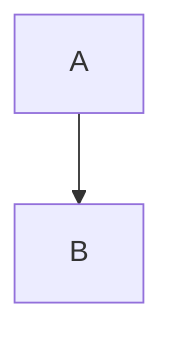

# mermaid-py Quick Reference Guide

## Installation

```bash
pip install mermaid-py
```

## Basic Template

```python
from mermaid import Mermaid

# Define diagram as string
diagram_code = """
[diagram type]
[diagram content]
"""

# Create Mermaid object
mmd = Mermaid(diagram_code)

# Convert to string if needed
code_string = str(mmd)

# Export (requires mermaid-cli)
# mmd.to_png("output.png")
# mmd.to_svg("output.svg")
```

---

## Diagram Type Reference

### 1. Sequence Diagram

```python
diagram_code = """sequenceDiagram
    participant Alice as Alice
    actor User as User
    participant Bob as Bob
    database DB as "Database"
    participant Charlie as Charlie
    
    User->>Alice: Request
    Alice->>Bob: Synchronous call
    Bob-->>Alice: Synchronous response
    
    Bob->>DB: Store data
    DB-->>Bob: Confirmation
    
    Bob->>Charlie: Asynchronous (fire & forget)
    activate Charlie
    Charlie->>Bob: Callback
    deactivate Charlie
    
    loop Every minute
        Alice->>Bob: Check status
    end
    
    alt Success case
        Bob-->>Alice: Status OK
        Alice-->>User: Success
    else Failure case
        Bob-->>Alice: Status FAILED
        Alice-->>User: Error
    end
"""
```

**Participant Types:**
- `participant` - Standard box (services, components)
- `actor` - Stick figure (users, external actors)
- `database` - Cylinder shape (databases, storage)

**Use for:** Component interactions, API calls, message flows

---

### 2. Flowchart

```python
diagram_code = """flowchart TD
    Start([Start])
    
    Decision{Condition?}
    Process1["Process A"]
    Process2["Process B"]
    End([End])
    
    Start --> Decision
    Decision -->|Yes| Process1
    Decision -->|No| Process2
    Process1 --> End
    Process2 --> End
    
    style Start fill:#90EE90
    style End fill:#FFB6C6
    style Decision fill:#87CEEB
"""
```

**Node shapes:**
- `[text]` - Rectangle
- `([text])` - Circle
- `{text}` - Diamond
- `[[text]]` - Subroutine
- `[(text)]` - Cylinder

**Use for:** Algorithms, processes, decision trees

---

### 3. Class Diagram

```python
diagram_code = """classDiagram
    class Animal {
        -String name
        -int age
        +get_name() String
        +set_name(String name)
        +birthday()
    }
    
    class Dog {
        -String breed
        +bark() void
    }
    
    class Cat {
        -String color
        +meow() void
    }
    
    Animal <|-- Dog: inherits
    Animal <|-- Cat: inherits
    Animal --> Veterinarian: visits
    
    class Veterinarian {
        +treat(Animal animal)
    }
"""
```

**Visibility markers:**
- `+` public
- `-` private
- `#` protected
- `~` package

**Relationships:**
- `<|--` Inheritance
- `*--` Composition
- `o--` Aggregation
- `-->` Association
- `--` Link

**Use for:** Architecture, OOP design, relationships

---

### 4. State Diagram

```python
diagram_code = """stateDiagram-v2
    [*] --> Active
    
    Active: Processing requests
    Active --> Idle: timeout
    
    Idle: Waiting
    Idle --> Active: request
    Idle --> Shutdown: stop
    
    Shutdown: Cleaning up
    Shutdown --> [*]
    
    note right of Active
        Handle incoming
        requests and data
    end note
"""
```

**Use for:** State machines, workflows, FSM documentation

---

### 5. Graph / Relationship

```python
diagram_code = """graph LR
    A["Component A"]
    B["Component B"]
    C["Component C"]
    
    A -->|calls| B
    A -->|sends data to| C
    C -->|updates| B
    
    style A fill:#ff9999
    style B fill:#99ff99
    style C fill:#9999ff
"""
```

**Use for:** System architecture, data flow, relationships

---

## Common Patterns

### Pattern 1: Conditional Logic

```python
"""flowchart TD
    Start([Start])
    Check{Is Valid?}
    
    Check -->|Yes| Success["✅ Success"]
    Check -->|No| Error["❌ Error"]
    
    Success --> End([End])
    Error --> End
"""
```

### Pattern 2: Loop/Iteration

```python
"""sequenceDiagram
    loop 3 times
        Actor->>Server: Request
        Server-->>Actor: Response
    end
"""
```

### Pattern 3: Parallel Processing

```python
"""flowchart TD
    Start([Start])
    
    Start --> A["Process A"]
    Start --> B["Process B"]
    Start --> C["Process C"]
    
    A --> End([End])
    B --> End
    C --> End
"""
```

### Pattern 4: Error Handling

```python
"""stateDiagram-v2
    [*] --> Running
    Running --> Error: exception
    Error --> Recovering: retry
    Recovering --> Running: success
    Recovering --> Failed: max retries
    Failed --> [*]
"""
```

---

## Styling

### Colors
```python
"""flowchart TD
    A["Node"]
    style A fill:#ff9999,stroke:#333,color:#000
"""
```

**Common colors:**
- `#ff9999` - Light red
- `#99ff99` - Light green
- `#9999ff` - Light blue
- `#ffff99` - Light yellow
- `#ff99ff` - Light pink

### Classes
```python
"""flowchart TD
    classDef errorStyle fill:#ff9999,stroke:#c33,color:#000
    classDef successStyle fill:#99ff99,stroke:#3c3,color:#000
    
    A["Error Node"]:::errorStyle
    B["Success Node"]:::successStyle
"""
```

---

## Tips & Tricks

1. **String escaping:** Use quotes for special characters
   ```python
   'Node["Text with \\"quotes\\""]'
   ```

2. **Line breaks:** Use `<br/>` in node labels
   ```python
   'A["Line 1<br/>Line 2"]'
   ```

3. **Unicode/Emoji:** Works directly
   ```python
   '✅ Success, 🚀 Launch, ❌ Error'
   ```

4. **Subgraphs:** Group related nodes
   ```python
   """flowchart TD
       subgraph Group1
           A --> B
       end
       subgraph Group2
           C --> D
       end
   """
   ```

5. **Comments:** Use `%%` for comments
   ```python
   '%% This is a comment'
   ```

---

## Advanced: Dynamic Diagram Generation

```python
def generate_state_machine(states, transitions):
    """Generate state diagram from data."""
    lines = ["stateDiagram-v2", "[*] --> " + states[0]]
    
    for src, dst, label in transitions:
        lines.append(f"    {src} --> {dst}: {label}")
    
    lines.append(f"    {states[-1]} --> [*]")
    return "\n".join(lines)

# Use it
states = ["Init", "Running", "Stopped"]
transitions = [
    ("Init", "Running", "start"),
    ("Running", "Stopped", "stop"),
]

diagram_code = generate_state_machine(states, transitions)
mmd = Mermaid(diagram_code)
```

---

## Rendering & Export

### Option 1: Online View
```
https://mermaid.live
```

### Option 2: Local PNG/SVG
```bash
# Requires: npm install -g @mermaid-js/mermaid-cli

mmdc -i diagram.mmd -o diagram.png       # PNG
mmdc -i diagram.mmd -o diagram.svg       # SVG
mmdc -i dir/*.mmd -o dir/                # Batch
```

### Option 3: Markdown
```markdown
# My Architecture


```

### Option 4: Python Export
```python
# Requires: pip install mermaid-py[all]
mmd = Mermaid(code)
mmd.to_png("output.png")
mmd.to_svg("output.svg")
```

---

## Resources

- **Official Mermaid Docs:** https://mermaid.js.org
- **Mermaid Live Editor:** https://mermaid.live
- **mermaid-py GitHub:** https://github.com/Dr-ZHUIM/mermaid-py
- **Mermaid Syntax Reference:** https://mermaid.js.org/intro/

---

## Troubleshooting

| Issue | Solution |
|-------|----------|
| Diagram not rendering | Check mermaid.live for syntax errors |
| PNG export fails | Install mermaid-cli: `npm install -g @mermaid-js/mermaid-cli` |
| Special characters not showing | Use HTML entities or escape properly |
| Diagram too complex | Break into multiple smaller diagrams |

---

**Happy Diagramming! 📊**
