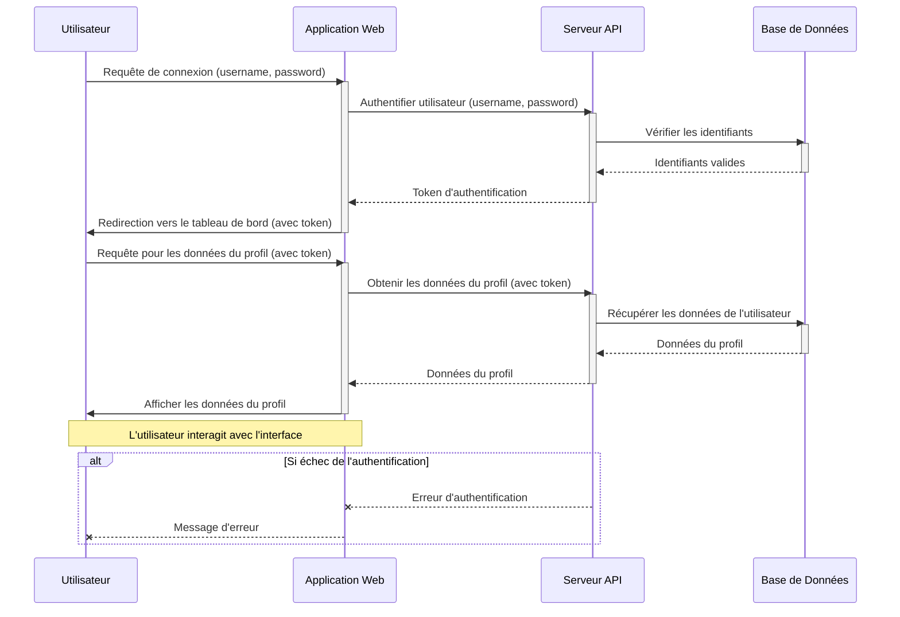

# Amélioration du Diagramme de Séquence Mermaid

Le diagramme de séquence Mermaid fourni ````mermaid.sequenceDiagram
database
```` est très basique et ne contient qu'un seul participant. Pour l'améliorer, nous allons créer un exemple plus complet et discuter des meilleures pratiques.

## Qu'est-ce qu'un Diagramme de Séquence ?

Un diagramme de séquence est un type de diagramme d'interaction qui montre comment les processus ou les objets interagissent les uns avec les autres dans une séquence chronologique. Il représente les participants et les messages qu'ils échangent.

## Exemple de Diagramme de Séquence Amélioré

Voici un exemple plus détaillé d'un diagramme de séquence représentant une interaction typique entre un utilisateur, une application web, un serveur d'API et une base de données.



## Explication des Éléments

*   **`participant`**: Définit un participant dans le diagramme. Vous pouvez lui donner un alias pour une meilleure lisibilité (ex: `User as Utilisateur`).
*   **`->>`**: Message synchrone (la flèche pointe vers le destinataire).
*   **`-->>`**: Message asynchrone (la flèche est en pointillé et pointe vers le destinataire).
*   **`--x`**: Message d'erreur ou de rejet (la flèche est en pointillé et se termine par une croix).
*   **`activate [Participant]`**: Indique le début d'une période d'activation (le participant est actif).
*   **`deactivate [Participant]`**: Indique la fin d'une période d'activation.
*   **`Note over [Participant1],[Participant2]: [Texte]`**: Ajoute une note couvrant un ou plusieurs participants.
*   **`alt [Condition]` ... `else` ... `end`**: Permet de définir des chemins alternatifs basés sur une condition.

## Meilleures Pratiques pour les Diagrammes de Séquence Mermaid

1.  **Nommez les Participants Clairement**: Utilisez des noms descriptifs pour chaque participant.
2.  **Utilisez des Alias**: Pour les noms longs ou techniques, utilisez `as` pour fournir un alias plus lisible.
3.  **Indiquez l'Activation/Désactivation**: Utilisez `activate` et `deactivate` pour montrer quand un participant est actif, ce qui aide à visualiser le flux de contrôle.
4.  **Messages Descriptifs**: Chaque message doit clairement indiquer l'action ou l'information échangée.
5.  **Types de Messages Appropriés**: Utilisez `->>` pour les appels synchrones et `-->>` pour les réponses ou les messages asynchrones.
6.  **Gérez les Erreurs**: Utilisez `--x` pour montrer les messages d'erreur ou les échecs.
7.  **Utilisez les Notes**: Ajoutez des notes pour clarifier des étapes complexes ou fournir un contexte supplémentaire.
8.  **Scénarios Alternatifs (`alt`)**: Utilisez `alt` pour représenter des chemins alternatifs, comme la gestion des erreurs ou des conditions différentes.
9.  **Évitez la Surcharge**: Ne mettez pas trop de détails dans un seul diagramme. Si un scénario est trop complexe, divisez-le en plusieurs diagrammes.
10. **Maintenez la Cohérence**: Utilisez une nomenclature et un style cohérents pour tous vos diagrammes.

En suivant ces directives, vous pouvez créer des diagrammes de séquence Mermaid clairs, informatifs et faciles à comprendre.
