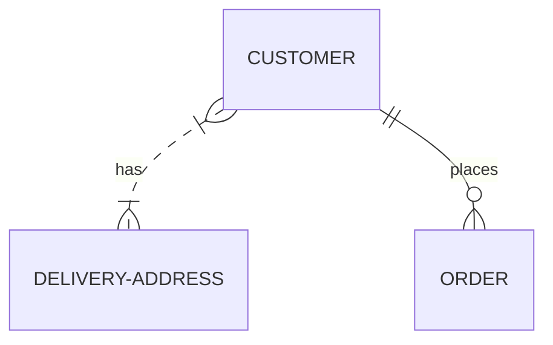

# Référence de la Syntaxe Mermaid

Ce document résume la syntaxe de Mermaid, en se basant sur la documentation officielle (`https://mermaid.ai/open-source/intro/syntax-reference.html`), pour faciliter la création de diagrammes compatibles.

## Structure Générale de la Syntaxe

Tous les diagrammes Mermaid commencent par une déclaration du type de diagramme, suivie de sa définition et de son contenu. Cette déclaration indique au parseur le type de diagramme à générer.

*   **Déclaration du type de diagramme**: Chaque diagramme commence par un mot-clé spécifique (ex: `graph`, `sequenceDiagram`, `erDiagram`).
*   **Commentaires**: Les commentaires de ligne peuvent être ajoutés avec `%% ` (deux signes de pourcentage suivis d'un espace).
*   **Mots inconnus/fautes de frappe**: Peuvent casser le diagramme.
*   **Paramètres mal formés**: Peuvent échouer silencieusement.

**Exemple de structure**:


## Éléments à Éviter (Diagram Breakers)

Certains mots ou symboles peuvent casser les diagrammes.

*   **Commentaires `%%{ }%%`**: Similaires aux directives, ils peuvent créer de la confusion. Évitez d'utiliser `{}` dans les commentaires `%%`.
*   **Mot 'end' (pour les Flow-Charts et Sequence diagrams)**: Peut casser le diagramme. Solution: Envelopper le mot entre guillemets (ex: `"End"`).
*   **Nœuds imbriqués dans les Flow-Charts**: Mermaid peut être confus. Solution: Envelopper les nœuds entre guillemets.

## Configuration des Diagrammes

Mermaid offre plusieurs méthodes pour personnaliser l'apparence et le comportement des diagrammes.

### Frontmatter pour le code du diagramme

Permet d'ajouter des métadonnées YAML au début du code du diagramme pour le reconfigurer avant le rendu.

*   **Syntaxe**: Commence et se termine par `---` sur des lignes séparées.
*   **Format**: Utilise la syntaxe YAML. L'indentation doit être cohérente et les paramètres sont sensibles à la casse.
*   **Exemple**:
    ```mermaid
    ---
    title: Exemple Frontmatter
    displayMode: compact
    config:
      theme: forest
    gantt:
        useWidth: 400
        compact: true
    ---
    gantt
        section Waffle
            Iron  : 1982, 3y
    ```

### Directives

Permettent une reconfiguration limitée d'un diagramme juste avant son rendu. Elles peuvent modifier le style de police, la couleur et d'autres aspects esthétiques.

*   **Syntaxe**: `%%{ }%%` à l'intérieur du code du diagramme, au-dessus ou en dessous de la définition.

### Manipulation des Thèmes

Le `Theme` est une valeur de configuration qui dicte la palette de couleurs des diagrammes. Il peut être modifié via le Frontmatter ou les Directives.

### Mise en page et Apparence (Layout and Look)

Mermaid permet de choisir différents styles ("looks") et algorithmes de mise en page. Actuellement, cela est pris en charge pour les flowcharts et les state diagrams, avec des plans d'extension à tous les types de diagrammes.

*   **Looks disponibles**:
    *   `handDrawn`: Pour un aspect plus personnel et créatif.
    *   `classic`: Le style traditionnel de Mermaid.
*   **Algorithmes de mise en page pris en charge**:
    *   `Dagre` (par défaut): Bon équilibre entre simplicité et clarté visuelle.
    *   `ELK`: Pour des capacités de mise en page plus sophistiquées, utile pour les diagrammes complexes. Nécessite d'être ajouté lors de l'intégration de Mermaid.
*   **Comment sélectionner un look/layout**: Via la section `config` du Frontmatter.
    *   **Exemple**:
        ```mermaid
        ---
        config:
          look: handDrawn
          theme: neutral
          layout: elk
        ---
        flowchart LR
          A[Start] --> B{Decision}
        ```
*   **Personnalisation de ELK**: Des options supplémentaires sont disponibles pour ELK, comme `mergeEdges` et `nodePlacementStrategy`.

## Types de Diagrammes (Non exhaustif, exemples courants)

La documentation complète de chaque type de diagramme est disponible dans la référence de syntaxe de Mermaid.

*   **Diagrammes de Séquence (`sequenceDiagram`)**: Montrent les interactions entre les participants dans un ordre chronologique.
    *   **Types de Participants**:
        *   `participant [Nom] as [Alias]`: Participant standard (boîte rectangulaire)
        *   `actor [Nom] as [Alias]`: Acteur (figure humaine)
        *   `database [Nom] as [Alias]`: Base de données (cylindre)
    *   `[Participant1]->>[Participant2]: Message synchrone`
    *   `[Participant1]-->>[Participant2]: Message asynchrone`
    *   `activate [Participant]` / `deactivate [Participant]`
    *   `Note over [P1],[P2]: Texte`
    *   `alt [Condition]` ... `else` ... `end`
    *   `loop [Texte]` ... `end`
*   **Flowcharts (`graph` ou `flowchart`)**: Représentent des processus ou des flux de travail.
    *   `[Direction]`: `LR` (Left-Right), `TB` (Top-Bottom), etc.
    *   `A[Texte du nœud]`
    *   `A --> B`
*   **Diagrammes d'Entité-Relation (`erDiagram`)**: Modélisent les relations entre les entités.
    *   `[Entité1] [Cardinalité]--[Cardinalité] [Entité2] : [Relation]`
*   **Diagrammes de Classes (`classDiagram`)**: Représentent la structure des classes.
    *   `class [NomClasse] { [Membres] }`
*   **Diagrammes de Gantt (`gantt`)**: Affichent les calendriers de projet.
    *   `section [NomSection]`
    *   `[Tâche] : [ID], [DateDébut], [Durée]`

Cette référence fournit une base solide pour la création de diagrammes Mermaid compatibles et expressifs. Pour des détails spécifiques à chaque type de diagramme, il est recommandé de consulter la documentation officielle.
